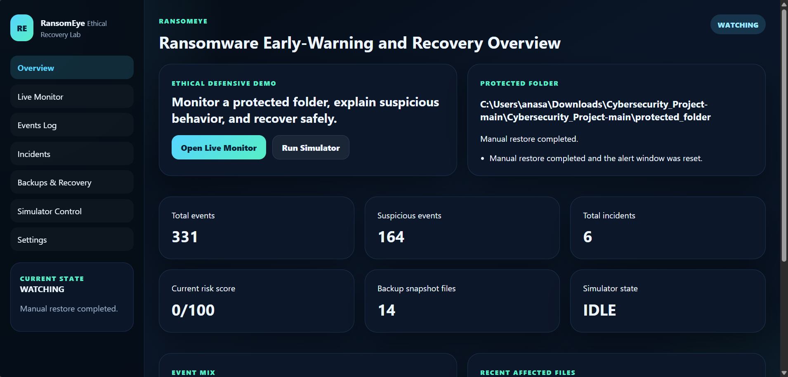

# RansomEye

Real-time ransomware behavior detection, explainable alerting, and automatic file recovery, built for cybersecurity education.



---

## What Is It?

RansomEye watches a protected folder for ransomware-like behavior: bulk file modifications, rename storms, suspicious extension changes, entropy spikes, and delete-recreate patterns. The moment activity crosses a high-risk threshold, it automatically preserves forensic evidence and restores clean files from backup, all visible in a live web dashboard.

This is a **defensive, educational project**. It contains no real ransomware, no destructive code, and no persistence or privilege escalation. The simulator only operates inside one controlled demo folder.

---

## Dashboard Pages

| Page | What you see |
|---|---|
| Overview | Live risk score, status banner, recent incident summary |
| Live Monitor | Real-time event feed, process snapshot, current risk explanation |
| Events | Full file event log with entropy and severity columns |
| Incidents | All detected incidents with evidence paths and recovery status |
| Backups and Recovery | Backup manifest, recovery timeline, manual restore |
| Simulator | Launch rename storm, entropy burst, or mixed attack |
| Settings | Reseed demo files, clear logs |

---

## Core Features

- **Real-time file monitoring** via `watchdog` -- events fire within milliseconds of any file change
- **7-signal behavioral scoring** -- each suspicious pattern adds weighted points to a 0-100 risk score
- **Explainable alerts** -- every alert shows exactly which signals triggered it in plain English
- **Two-tier incident response** -- MEDIUM saves a logged incident; HIGH triggers full automatic recovery
- **Instant simulator stop** -- recovery halts the simulator immediately using `threading.Event`, not a sleep loop
- **Post-recovery grace period** -- a 10-second window flushes OS-buffered watchdog events so restore activity never creates false incidents
- **Entropy and SHA-256 file profiling** -- detects encrypted content by measuring Shannon entropy change
- **SQLite forensic log** -- every event, incident, and recovery action is stored and queryable
- **Global recovery toast** -- a notification appears across all dashboard pages when auto-recovery fires
- **Process snapshot** -- background-refreshed process list shows which programs are most active

---

## Detection Logic

Every file event is evaluated against a **15-second rolling window**. Seven signals are counted and converted to a weighted risk score:

| Signal | What it detects |
|---|---|
| Mass modifications | Many files rewritten in a short burst |
| Many unique files touched | Breadth of the attack across different files |
| Rename storm | Files renamed to suspicious extensions like `.locked` |
| Suspicious extensions | Any path matching `.locked`, `.enc`, `.cry`, `.crypted`, etc. |
| Delete and recreate | File deleted then recreated (the encrypt-in-place pattern) |
| Entropy spike | File content entropy jumped sharply toward 8.0 (maximum randomness) |
| Dominant process | One process linked to the majority of rapid file events |

**Risk levels:**

```
 0 - 40  ->  LOW      Normal activity
41 - 70  ->  MEDIUM   Suspicious -- incident logged, operator notified
71 - 100 ->  HIGH     Attack detected -- evidence saved, files restored
```

---

## Simulator Scenarios

All scenarios run exclusively inside `protected_folder/` and can be stopped at any time.

| Scenario | Behavior | Expected severity |
|---|---|---|
| `rename_storm` | Renames 8 files to `.locked` | MEDIUM |
| `entropy_burst` | Overwrites 12 files with random high-entropy content | HIGH |
| `mixed_attack` | Combines entropy overwrite, rename, and delete/recreate on 14 files | HIGH |

---

## Architecture

```
watchdog (OS events)
     |
     v
ProtectedFolderMonitor   <-- ProcessTracker (background refresh)
     |
     v
DetectionEngine          <-- rolling 15-second window, 7 signals
     |
     v
score_behavior()         <-- weighted additive scoring -> LOW / MEDIUM / HIGH
     |
     v
RansomEyeLab.handle_event()
     +-- LOW     -> log event
     +-- MEDIUM  -> log event + create incident (no recovery)
     +-- HIGH    -> stop simulator -> preserve evidence -> restore backup -> reset detector
```

**Component map:**

| File | Role |
|---|---|
| `app.py` | Flask routes and API endpoints |
| `config.py` | All thresholds, paths, and constants |
| `core/lab.py` | Central coordinator connecting all components |
| `core/monitor.py` | Watchdog wrapper, emits normalized file events |
| `core/detector.py` | Rolling window analysis and cooldown management |
| `core/scorer.py` | Converts signal counts to a weighted 0-100 score |
| `core/entropy.py` | Shannon entropy and SHA-256 file profiling |
| `core/process_tracker.py` | Background psutil snapshot for process correlation |
| `core/incident_logger.py` | SQLite writes with 4-second stats cache |
| `core/backup_manager.py` | Backup snapshot creation and full restore |
| `core/recovery.py` | Evidence preservation and recovery orchestration |
| `core/simulator.py` | Safe attack scenarios with instant-stop support |

---

## Installation

**Requirements:** Python 3.11+, Windows (tested), VS Code recommended.

```powershell
# 1. Create and activate virtual environment
python -m venv .venv
.\.venv\Scripts\activate

# 2. Install dependencies
pip install -r requirements.txt

# 3. Run
python app.py
```

Open **http://127.0.0.1:5000** in your browser.

---

## Demo Walkthrough

1. Open the dashboard -- status should show **WATCHING**
2. Go to **Settings** and click **Reseed Demo Files** to populate the protected folder
3. Go to **Simulator** and run **Rename Storm** -- watch it reach MEDIUM on the Overview
4. Run **Entropy Burst** or **Mixed Attack** -- watch the score climb to HIGH, auto-recovery fires, and the toast notification appears
5. Open **Incidents** to see the logged incident with affected files and evidence path
6. Open **Backups and Recovery** to see the recovery timeline and restored file count

---

## Security Design Decisions

| Decision | Why it matters |
|---|---|
| `threading.Lock` on shared state | Watchdog fires events from a background thread; Flask reads state from another -- the lock prevents torn reads |
| SQL column whitelist in `update_incident` | Blocks SQL injection by rejecting any column name not in the allowed set before it reaches the query |
| Backup refresh blocked during ALERT/RECOVERY | Prevents accidentally overwriting the clean backup with already-compromised files |
| Post-recovery grace period (10 s) | Flushes OS-buffered watchdog events from the restore operation so they cannot score as a new attack |
| `threading.Event` for simulator stop | Recovery stops the simulator instantly instead of waiting for the next sleep to expire |

---

## Limitations

- Process attribution is a best-effort approximation, not kernel-level per-file ownership
- Entropy heuristics can produce false positives in environments with legitimately random data (compressed archives, encrypted volumes)
- The backup system is a single clean snapshot, not a versioned history
- Watchdog event granularity varies by OS and some editors trigger extra events on save

---

## Ethical Use

This project is for cybersecurity awareness, defensive research, and university demonstration only. Do not point the protected folder at any directory containing real personal or system files.