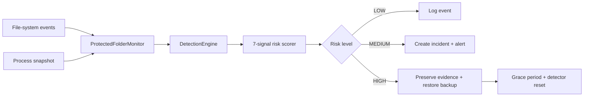

<div align="center">

# RansomEye

### Explainable ransomware-behavior detection, incident evidence, and automatic file recovery.


**Behavioral Detection · Entropy Analysis · Risk Scoring · Forensic Logging · Automated Recovery**

</div>


---

## Why RansomEye?

RansomEye is a defensive cybersecurity project that watches a controlled folder for ransomware-like behavior rather than relying on a single filename or signature. It combines multiple behavioral signals into an explainable risk score and demonstrates an end-to-end defensive workflow: **observe → score → alert → preserve evidence → recover**.

The project contains **no real ransomware, destructive payload, persistence, or privilege-escalation code**. Its simulator is intentionally restricted to a controlled demo folder.

## Detection Pipeline



## Dashboard

| Page | Purpose |
|---|---|
| **Overview** | Live risk score, status banner, recent incident summary |
| **Live Monitor** | Real-time event feed, process snapshot, current risk explanation |
| **Events** | Full file-event log with entropy and severity |
| **Incidents** | Detected incidents, evidence paths, and recovery status |
| **Backups & Recovery** | Backup manifest, recovery timeline, manual restore |
| **Simulator** | Safe rename-storm, entropy-burst, and mixed-attack scenarios |
| **Settings** | Reseed demo files and clear logs |

## Core Engineering Features

- **Real-time file monitoring** with `watchdog`
- **7-signal behavioral scoring** mapped to a 0–100 risk score
- **Explainable alerts** that identify which signals caused escalation
- **Two-tier incident response** where MEDIUM records an incident and HIGH triggers recovery
- **Instant simulator stop** using `threading.Event`
- **Post-recovery grace period** to prevent restore operations from creating false incidents
- **Entropy + SHA-256 profiling** for suspicious content-change analysis
- **SQLite forensic logging** for events, incidents, and recovery actions
- **Process snapshots** for best-effort activity correlation
- **Automatic evidence preservation and clean-file restoration**

## Detection Logic

Every event is evaluated inside a **15-second rolling window**. Seven signals contribute to the final score:

| Signal | What it detects |
|---|---|
| Mass modifications | Many files rewritten in a short burst |
| Many unique files touched | Attack breadth across files |
| Rename storm | Rapid renames to suspicious extensions |
| Suspicious extensions | Paths ending in patterns such as `.locked`, `.enc`, `.cry`, `.crypted` |
| Delete and recreate | Encrypt-in-place-style delete/recreate behavior |
| Entropy spike | Content becoming sharply more random |
| Dominant process | One process associated with most rapid activity |

### Risk Levels

```text
 0 - 40  → LOW      Normal activity
41 - 70  → MEDIUM   Suspicious — incident recorded and operator notified
71 - 100 → HIGH     Attack-like behavior — evidence preserved and files restored
```

## Safe Simulation Scenarios

All scenarios operate only inside `protected_folder/`.

| Scenario | Behavior | Expected severity |
|---|---|---|
| `rename_storm` | Renames 8 files to `.locked` | MEDIUM |
| `entropy_burst` | Overwrites 12 files with high-entropy random content | HIGH |
| `mixed_attack` | Combines entropy overwrite, rename, and delete/recreate across 14 files | HIGH |

## Component Map

| File | Responsibility |
|---|---|
| `app.py` | Flask routes and API endpoints |
| `config.py` | Thresholds, paths, and constants |
| `core/lab.py` | Central coordinator |
| `core/monitor.py` | File-system monitoring and normalized events |
| `core/detector.py` | Rolling-window analysis and cooldown management |
| `core/scorer.py` | Weighted 0–100 behavior scoring |
| `core/entropy.py` | Shannon entropy and SHA-256 profiling |
| `core/process_tracker.py` | Background process snapshots |
| `core/incident_logger.py` | SQLite persistence and statistics cache |
| `core/backup_manager.py` | Backup snapshots and restoration |
| `core/recovery.py` | Evidence preservation and recovery orchestration |
| `core/simulator.py` | Controlled attack-like scenarios |

## Security Design Decisions

| Decision | Why it matters |
|---|---|
| `threading.Lock` on shared state | Prevents torn reads between watchdog and Flask threads |
| SQL column whitelist | Rejects non-approved column names before a dynamic update reaches SQLite |
| Backup refresh blocked during ALERT/RECOVERY | Protects clean backups from being replaced by compromised data |
| 10-second post-recovery grace period | Flushes buffered restore events so recovery does not trigger a new incident |
| `threading.Event` for simulator stop | Lets recovery stop a simulation immediately |

## Install & Run

**Requirements:** Python 3.11+, Windows (tested).

```powershell
python -m venv .venv
.\.venv\Scripts\activate
pip install -r requirements.txt
python app.py
```

Open `http://127.0.0.1:5000`.

## Demo Walkthrough

1. Open the dashboard and confirm the system is **WATCHING**.
2. Use **Settings → Reseed Demo Files**.
3. Run **Rename Storm** and observe MEDIUM risk behavior.
4. Run **Entropy Burst** or **Mixed Attack** and observe HIGH-risk recovery.
5. Review the generated incident and evidence path.
6. Open **Backups & Recovery** to inspect restoration results.

## Limitations

- Process attribution is a best-effort approximation, not kernel-level per-file ownership.
- Entropy heuristics may false-positive on legitimately random data such as encrypted or compressed files.
- The backup layer is a single clean snapshot rather than versioned history.
- Watchdog event granularity varies by operating system and application behavior.

## Ethical Use

RansomEye is intended for cybersecurity education, defensive research, and controlled university demonstrations. Do not point its protected folder at real personal or system directories.

---

<div align="center">

### Built by Tarek Elsayed

**Computer Science · Defensive Security · Software Engineering**

[GitHub Profile](https://github.com/tarekkalsayed-pixel)

</div>
